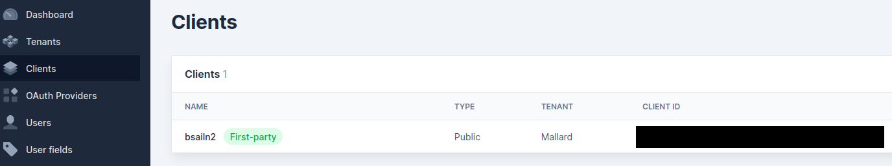
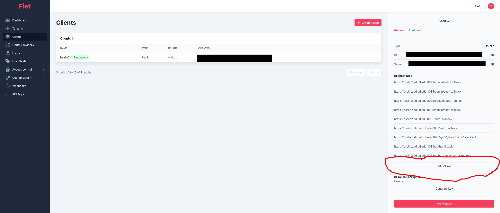
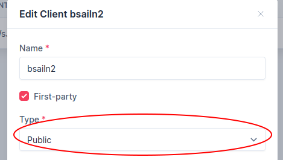

# Developing

If you are interested in developing MALLARD, please see
[these instructions](docs/developing.md).

# Deploying Locally

MALLARD can be deployed locally using Docker. The provided configuration
contains everything you need to run a local instance of MALLARD, including
a MariaDB database for metadata, and a MinIO object store for image data.

Prerequisites:
- Docker >= 19.03.0
- `docker-compose`
- [cookiecutter](https://cookiecutter.readthedocs.io/en/2.0.2/installation.html)

Compose files for MALLARD are generated interactively based on your chosen
configuration. To generate a new compose file, run:

```bash
cookiecutter cookiecutter-docker/
```

You will be given the chance to specify the following options:
- `config_name`: A human-readable name for this configuration.
- `mode`: The mode to run MALLARD in. Development mode means that the local
  filesystem will be mounted inside the containers instead of copying the
  code over, so that you can test new code without rebuilding Docker images.
  If you are not testing new code, use production mode.
- `proxy_config`: Specifies the configuration to use for MALLARD's built-in
  reverse proxy. By default, it will use SSL. Disabling SSL could break
  things, because MALLARD uses features of modern browsers that only run in
  a secure context. However, there are legitimate reasons for disabling SSL.
  For instance, you might wish to run MALLARD behind your own reverse proxy
  and handle SSL there.
- `host_port`: The port that MALLARD will listen on for connections.
- `object_location`: Specifies the path where data uploaded to MALLARD will
  be stored.
- `metadata_location`: Specifies the path where the MALLARD database will be
  stored.
- `backup`: If true, it will enable the containers necessary for backing up
  data. Enable if you are planning to use MALLARD's [built-in backup
  capabilities](#backing-up)
- `tempdir`: Specifies a custom location for the temporary directory that
  MALLARD will use. This can be useful if you have limited disk space,
  because MALLARD will store large temporary files.

A `docker-compose` file will be created in the repository root, named based
on the value you set for `config_name`. For instance, if you set
`config_name` to "default", it will generate a `docker-compose.default.yml`
file. To generate multiple configurations, you can re-run the cookiecutter
command with different `config_name`s.

Once you have the compose file, you can run the following to build the
images and start the MALLARD services:
```bash
docker compose -f docker-compose.default.yml build
docker compose -f docker-compose.default.yml up
```

## Initializing the Database

The first time you start MALLARD with `docker-compose up`, it creates a blank
database. To actually use MALLARD, this database needs to be initialized with
the proper tables. A script for doing this is conveniently included.

First, you will need to figure out the name of the `gateway` service container,
using `docker ps`. Most likely, it will be `mallard_gateway_1`. Then, to initialize
the database, run:
```bash
docker exec mallard-gateway-1 /init_db.sh
```

This only has to be done once, unless you delete the MALLARD Docker volumes. On
subsequent restarts, you should be able to use MALLARD normally without this step.

## Accessing the Application

The MALLARD application should be accessible on your local machine at
https://localhost:8081 (or whatever you set `host_port` to). The MALLARD API
should be accessible at https://localhost:8081/api/v1. To access a convenient
interface that allows you to test the API manually, visit
https://localhost:8081/api/v1/docs.

# Backing Up

Any production deployment of MALLARD is likely going to need some mechanism
to back up the data. MALLARD includes some functionality designed to
simplify this. Currently, it only works with the default MinIO+MariaDB
backend. To enable backups, use the following procedure:

1. Generate your compose file with the `backup` configuration option set to
   true. (See [this section](#deploying-locally).)
1. Start the MALLARD server. After initialization completes, you should see
   a new sub-directory in the current folder called `backups/`. This
   directory allows for access to the data in the object store through
   [s3fs](https://github.com/s3fs-fuse/s3fs-fuse). Additionally, the contents of
   the metadata DB will be automatically dumped to this folder once per day.
1. Point your favorite backup tool at the `backups/` directory.

## Restoring

Since the object store is mirrored through S3FS, restoring it should be
trivial: just restore all the files into the original folder. Restoring
the metadata involves accessing the latest DB dump (located in
`/backups/metadata/`) and restoring it manually to MariaDB.

# Authentication

In the event that MALLARD is exposed on a public network, you will probably
want some control over who has access to it. MALLARD currently supports user
authentication through [Fief](https://www.fief.dev/). Note that, going forward,
we will assume that you have [installed and configured](https://docs.fief.dev/getting-started/introduction/)
Fief and it is running at `https://example.fief.dev/`.

## MALLARD Configuration

The MALLARD config file must be updated to enable authentication. For a
default (production) deployment, the [`local_config.yaml`](config/local/local_config.yaml)
file will be used. Modify this file and rebuild the Docker container to change
the configuration.

Under the `security` section, there is an `enable_auth` option that defaults to
`false`. Instead, you will want to set it to `true`, and add the additional
`fief` section that is present in [the example config](config/examples/example_config_auth.yaml).
Fill out the `base_url` and `client_id` parameters appropriately for your Fief
configuration. The `client_id` can be found on the Fief admin page:


## Fief Configuration

For authentication to work in Fief, you have to configure your client to allow
all of the MALLARD redirect URIs. This can be done on the Fief admin page,
in the "Clients" section, by clicking on the client you are using. It should
open up a panel on the right with a list of redirect URIs. Click the "Edit
Client" button at the bottom.


This will open a modal where you can change the client settings. First of
all, under "Type", select "Public".


Also, under "Redirect URIs", add the following new entries:
- `https://mallard.example.com/auth_callback`
- `https://mallard.example.com/api/v1/docs/oauth2-redirect`

Note that you should change `mallard.example.com` to whatever domain your
MALLARD deployment is served at.
